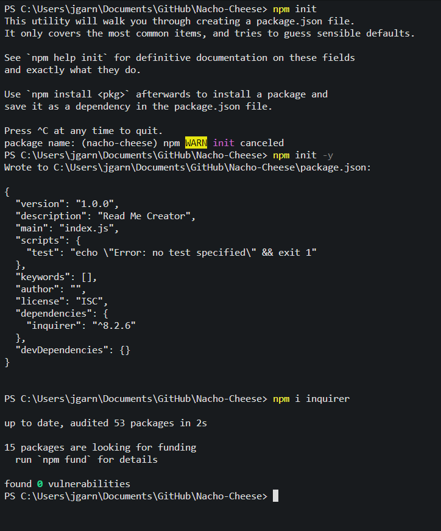
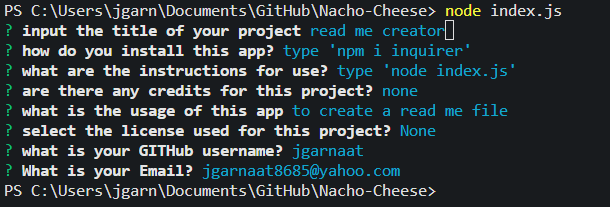

# Nacho Cheese (The Read Me Creator)

## Description

This app aims to assist in creating a professional read me file for any project you have created

## Table of Contents

- [Installation](#installation)
- [Usage](#usage)
- [License](#license)

## Installation

1. Open the integrated terminal and type 'npm init -y' to initialize NPM
2. type 'npm i inquirer' to install the package
3. type 'node index.js' to start the app

## Usage

After starting the app, simply answer the question prompts, and your Read Me will be created

## License

N/A

## Links

Here is a link to the GIThub of the app
https://github.com/Jgarnaat/Nacho-Cheese